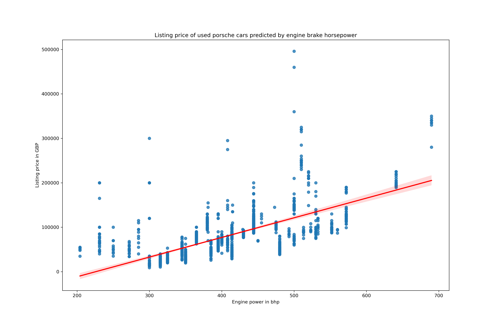

# Linear Regression Project MVP

## Analysis of prices of used Porsche cars on Autotrader.co.uk

The figure shows a linear regression model which attempts to describe listing price or a used porsche as a function of a single feature, namely engine power.

The model is plotted in red, with 95% confidence interval plotted in translucent red, and actual data points in blue.

The result suggests that whilst there is a positive correlation between power and price, there are other important features at play not contained within this model. (There is also caution needed because the predicted price according to this model goes below zero for cars with the least engine power, which is clearly not realistic)

